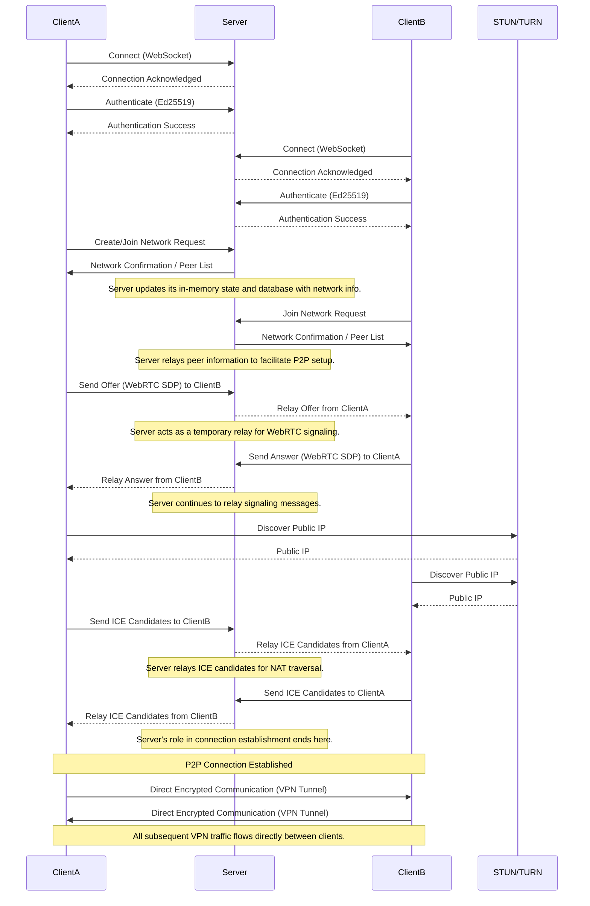

# GoVPN


**🚧 WORK IN PROGRESS 🚧**

This project is currently under active development. It is not yet functional, and there are no stable releases available.

A Virtual Local Area Network (VLAN) solution for games that allows players to connect as if they were on the same local network.

## Features

- Create and join virtual game networks
- NAT traversal using STUN/TURN for P2P connections
- End-to-end encryption
- Cross-platform support (Windows, macOS, Linux)
- Local data storage using SQLite

## System Architecture

GoVPN is organized in a modular client-server architecture, with P2P communication between clients to minimize latency. The architecture is structured as follows:

### Shared Libraries

- **libs/crypto_utils**: Implements cryptographic functions to ensure communication security, including:
  - Ed25519 key generation
  - Message signing and verification
  - Encryption for transmitted data
  - Secure identifier generation

- **libs/models**: Defines data structures shared between client and server:
  - Network: Represents a virtual game network
  - Message: Defines the format of messages exchanged via WebSocket
  - NetworkPacket: Structure for network packets tunneled through the VPN
  - ClientInfo: Information about connected clients

- **libs/network**: Manages the virtual network interfaces and packet handling, including:
  - VirtualNetwork: Main class that coordinates peer communication
  - Virtual IP address mapping
  - Encapsulation and routing of packets between clients
- **libs/signaling**: Provides the client-side signaling logic and data models for WebSocket communication with the server, including:
  - client: Implements the WebSocket client for signaling
  - models: Defines signaling-specific message structures

### System Components

- **cmd/server**: The central signaling server responsible for orchestrating network operations and facilitating P2P connections. Its key functions include:
  - **Network Creation and Management**: Handles the creation, joining, and management of virtual VPN networks.
  - **Client Authentication**: Authenticates clients using Ed25519 keys to ensure secure access.
  - **Connection Establishment**: Relays signaling messages (e.g., WebRTC SDP offers/answers, ICE candidates) between clients to help them establish direct P2P connections.
  - **Data Persistence**: Utilizes Supabase for persistent storage of network and client metadata.
  - **WebSocketServer**: Manages all incoming and outgoing WebSocket connections with clients.
  - **SupabaseManager**: Provides an interface for interacting with the Supabase database.

- **cmd/client**: The client application with a graphical user interface (GUI) that allows users to:
  - Create and join virtual game networks.
  - Manage P2P connections to other clients within a network.
  - Store local configurations and data using SQLite.
  - Provides a user-friendly interface built with Fyne (v2.0+).
  - Composed of modular components like `NetworkManager`, `SignalingClient`, etc., for clear separation of concerns.

### Communication Flow

The communication in GoVPN follows a hybrid model, leveraging a central server for signaling and P2P connections for actual data transfer.



1. **Signaling Phase**:
   - The server acts as a crucial intermediary for initial connection establishment and coordination.
   - Clients connect to the server via WebSockets, authenticate using Ed25519 keys, and exchange metadata about available networks and peers.
   - The server maintains an in-memory representation of active networks and connected peers, ensuring real-time updates.
   
2. **P2P Connection Establishment**:
   - Once clients are authenticated and aware of each other, they use the server to exchange WebRTC signaling messages (SDP offers/answers and ICE candidates).
   - STUN (Session Traversal Utilities for NAT) servers are used by clients to discover their public IP addresses, aiding in NAT traversal.
   - TURN (Traversal Using Relays around NAT) servers provide a fallback relay mechanism if a direct P2P connection cannot be established.
   - The server's role in this phase is purely to relay these signaling messages; it does not process or store the actual WebRTC data.

3. **Direct Communication (VPN Tunnel)**:
   - After the WebRTC handshake is complete, a direct P2P connection (VPN tunnel) is established between the clients.
   - All subsequent VPN traffic (network packets) flows directly between the connected clients, bypassing the signaling server.
   - Data is end-to-end encrypted using a key derived from the network password, ensuring privacy and security.

4. **Virtual Network**:
   - Each client within a network is assigned a unique virtual IP address (e.g., in the 10.10.0.x range).
   - Network packets are encapsulated, encrypted, and routed through these direct P2P data channels, creating a virtual local area network.

## Current Project Structure

The current project structure is organized as follows:

```
.github/                         # GitHub Actions workflows and configurations
cmd/                             # Main application components
    client/                      # GoVPN client application
        data/                    # Real-time data layer for UI updates
        dialogs/                 # UI dialogs and modal windows
        icon/                    # Application icons and graphic resources
            assets/              # Image files for icons
        storage/                 # Local database (SQLite) and configuration management
        *.go                     # Core UI components and client-side logic
    server/                      # GoVPN signaling server
        docs/                    # API documentation for the server's WebSocket interface
        logger/                  # Logging utilities
        *.go                     # Core server implementation files
libs/                            # Shared libraries and common utilities
    crypto_utils/                # Cryptographic utilities for key management and encryption
    models/                      # Defines data structures and message formats shared across client and server
    network/                     # Manages the virtual network interfaces and packet handling
    signaling/                   # Signaling client and models for WebSocket communication
migrations/                      # SQL scripts for database schema management
README.md                        # Main documentation
```

### Main Client Components

- **UIManager**: Orchestrates the entire client-side graphical user interface.
- **VPNClient**: Manages the overarching VPN connection logic and state.
- **NetworkManager**: Handles the creation, joining, and management of virtual networks.
- **SignalingClient**: Manages the WebSocket communication with the central signaling server.
- **DatabaseManager**: Interfaces with the local SQLite database for persistent storage.
- **ConfigManager**: Manages application settings and user preferences.
- **RealtimeDataLayer**: Provides observable data bindings to ensure the UI is always synchronized with the application's state.

### Main Server Components

- **WebSocketServer**: The core of the server, responsible for:
    - Managing all active WebSocket connections.
    - Handling incoming signaling messages from clients.
    - Maintaining in-memory state of networks and connected peers.
    - Relaying WebRTC signaling messages between clients.
- **SupabaseManager**: A dedicated module for interacting with the Supabase backend, handling:
    - Network creation, retrieval, and deletion.
    - Management of computer-network relationships (which computer belongs to which network).
    - Updating network activity timestamps.
- **Network Management**: Encompasses the logic for:
    - Creating new virtual networks with unique IDs and passwords.
    - Allowing clients to join existing networks.
    - Assigning unique virtual IP addresses to connected peers within a network.
    - Handling network activity updates and cleanup of stale networks.
- **Authentication**: Implements secure client authentication based on Ed25519 public keys, ensuring only authorized clients can interact with the server.
- **Connection Management**: Manages the lifecycle of client connections, including:
    - Tracking connected peers in memory (`connectedPeers` map).
    - Handling disconnections and notifying other peers in the network.
    - Ensuring proper cleanup of resources when clients disconnect or leave networks.
    - Implementing graceful shutdown procedures.
- **StatsManager**: Collects and provides real-time statistics about server performance, active connections, and network usage.
- **Logger**: Provides structured logging capabilities for monitoring server operations and debugging.


## Server WebSocket API

The server implements a robust WebSocket API for communication with clients. Full documentation is available at `cmd/server/docs/websocket_api.md`.

### Main Message Types

- **Client to Server**:
  - `CreateNetwork`: Creates a new network
  - `JoinNetwork`: Joins an existing network
  - `LeaveNetwork`: Leaves a network
  - `Kick`: Kicks a computer from a network
  - `Rename`: Renames a network

- **Server to Client**:
  - `NetworkCreated`: Network creation confirmation
  - `NetworkJoined`: Network join confirmation
  - `PeerJoined`: Notification of a new peer in the network
  - `PeerLeft`: Notification of a peer leaving the network
  - `NetworkDeleted`: Notification of network deletion

## Server Environment Variables

| Variable | Description | Default |
|----------|-------------|---------|
| `PORT` | Port for the server to listen on | `8080` |
| `ALLOW_ALL_ORIGINS` | Allow WebSocket connections from any origin | `true` |
| `PASSWORD_PATTERN` | Regex to validate network passwords | `^\d{4}$` |
| `MAX_NETWORKS` | Maximum number of allowed networks | `100` |
| `MAX_CLIENTS_PER_NETWORK` | Maximum number of clients in a network | `10` |
| `LOG_LEVEL` | Log level (info, debug) | `info` |
| `IDLE_TIMEOUT_SECONDS` | Timeout for inactive connections in seconds | `60` |
| `PING_INTERVAL_SECONDS` | WebSocket ping interval in seconds | `30` |
| `READ_BUFFER_SIZE` | WebSocket read buffer size | `1024` |
| `WRITE_BUFFER_SIZE` | WebSocket write buffer size | `1024` |
| `SUPABASE_URL` | Supabase URL for network persistence (required) | `""` |
| `SUPABASE_KEY` | Supabase API key for authentication (required) | `""` |
| `NETWORK_EXPIRY_DAYS` | Days after which inactive networks are deleted | `7` |
| `CLEANUP_INTERVAL_HOURS` | Interval for cleaning up expired networks in hours | `24` |

**Note:** `SUPABASE_URL` and `SUPABASE_KEY` are required for proper server operation.

## Client Interface

The GoVPN client features a graphical interface built with Fyne 2.0+ with a fixed size of 300x600 pixels. Main features:

- **Home Tab**: Displays saved networks and connection options
- **Settings Tab**: Application settings
- **Network List**: List of saved networks with connection options
- **Dialogs**: For creating/joining networks and managing connections

### Local Storage

The client stores data locally using SQLite, including:

- Computer settings
- Saved networks and passwords
- Connection history
- Cryptographic keys

## Release Process

This project uses GitHub Actions to automatically build and release the server and client components.

### Creating a Server Release

To create a new server release:

```bash
# Tag the commit with a server version
git tag server-v1.0.0
git push origin server-v1.0.0
```

This will trigger the server release workflow that builds binaries for:
- Linux (amd64)
- Windows (amd64)
- macOS (Intel/amd64)
- macOS (Apple Silicon/arm64)

### Creating a Client Release

To create a new client release:

```bash
# Tag the commit with a client version
git tag client-v1.0.0
git push origin client-v1.0.0
```

This will trigger the client release workflow that builds:
- Standalone binaries for Linux, Windows, and macOS
- Packaged applications when possible

## Manual Compilation

### Server

```bash
# Build the server executable
go build -o govpn-server ./cmd/server/main.go
```

### Client

```bash
# Build the client executable
go build -o govpn-client ./cmd/client/main.go
```

For packaged applications using Fyne:

```bash
go install fyne.io/fyne/v2/cmd/fyne@latest
# Make sure you are in the project root directory
cd cmd/client
fyne package -os windows -icon icon/assets/app.png -name GoVPN
# Or for other platforms: linux, darwin
```

## Running the Application

### Server

```bash
# Set required environment variables
export SUPABASE_URL="your-supabase-url"
export SUPABASE_KEY="your-supabase-key"

# Run the server (compiled binary)
./govpn-server
```

### Client

```bash
# Run the client (compiled binary)
./govpn-client
```

### Running from Source (Development)

To run the application directly from source code without compiling:

#### Server
```bash
# Set required environment variables
export SUPABASE_URL="your-supabase-url"
export SUPABASE_KEY="your-supabase-key"

# Run using go run (single line command)
cd cmd/server && go run main.go
```

#### Client
```bash
# Run using go run (single line command)
cd cmd/client && go run .
```

### VS Code Tasks

- Press `Ctrl+Shift+P` (or `Cmd+Shift+P` on macOS)
- Type "Tasks: Run Task"
- Select "Run GoVPN Server" or "Run GoVPN Client"

## Security Features

- Authentication based on Ed25519 keys
- Validated network passwords (default: 4 numeric digits)
- Encrypted communication between client and server
- Secure local credential persistence

## Contributions and Development

To contribute to the project:

1. Fork the repository
2. Create a branch for your feature (`git checkout -b feature/new-feature`)
3. Commit your changes (`git commit -am 'Add new feature'`)
4. Push to the branch (`git push origin feature/new-feature`)
5. Create a Pull Request

## Implementation Notes

- The client is built with Fyne 2.0+ and has a fixed size of 300x600
- The server uses Gorilla WebSocket for real-time communication
- The system uses Supabase for server data persistence
- P2P communication uses WebRTC to establish direct connections between clients

## Troubleshooting

- **Connection error**: Check if the server is running and environment variables are set
- **Fyne compilation issues**: Make sure Fyne requirements are installed (gcc, graphic dependencies)
- **SQLite errors**: Check permissions for the ~/.govpn directory

## License

[MIT License](LICENSE)